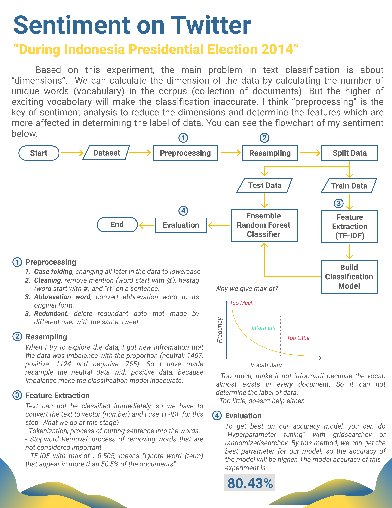

# Sentiment-Analysis-on-Twitter

In this sentiment project, I used "Tweet Data During Indonesia Presidential Election in 2014" and try to analyst about the data. In the end, i also try to make multiclass classification (positive, negative and neutral) based on the tweet data. The main problem in text classification is about “dimensions”.  We can calculate the dimension of the data by calculating the number of unique words (vocabulary) in the corpus (collection of documents). But the higher of exciting vocabolary will make the classification inaccurate.

**How to run the project:**
<ol>
  <li>Download the "data folder" and save it on your drive, but you can also save it in your local directory</li>
  <li>Open google colab and then upload this file "DSI_Melek_Sentiment_Workshop.ipynb" or "Sentiment_On_Tweet_Project_DSI.ipynb" </li>
  <li>Make sure you have uploaded the data on google colab or amount the data from google drive</li>
  <li>Run the code every line by shift+enter</li>
  <li>If you got errors when run the library, just install the library (serach on https://stackoverflow.com/)</li>
</ol>

**Project Overview:**

